# JFcars database architecture

JFcars uses Cloudflare D1 (SQLite) for structured data and Cloudflare R2 for
uploaded images and videos. The Drizzle schema in `db/schema.ts` is the source
of truth; append-only migrations live in `drizzle/`.

## Current relational structure

```mermaid
erDiagram
    VEHICLES ||--o{ VEHICLE_MEDIA : has
    AUTH_USERS ||--o{ AUTH_SESSIONS : owns
    AUTH_USERS ||--o{ EMAIL_VERIFICATION_TOKENS : verifies_with
    AUTH_USERS o|--o| USER_PROFILES : configures
    VEHICLES o|--o{ ORDER_ITEMS : referenced_by
    VEHICLES ||--o{ USER_VEHICLE_LISTS : saved_in
    USER_PROFILES ||--o{ USER_VEHICLE_LISTS : owns
    ORDERS ||--|{ ORDER_ITEMS : contains
    GALLERY_ITEMS ||--o{ GALLERY_ITEM_TRANSLATIONS : localized_as
    SELL_REQUESTS ||--o| SELL_REQUEST_DETAILS : describes
    SELL_REQUESTS ||--o{ SELL_REQUEST_MEDIA : includes

    VEHICLES {
        integer id PK
        text make
        text model
        integer year
        integer price
        integer mileage_km
        text origin
        text country
        text city
        text import_region
        boolean rentable
        boolean available
        boolean hidden
    }
    VEHICLE_MEDIA {
        integer vehicle_id PK, FK
        text purpose PK
        integer position PK
        text url
    }
    AUTH_USERS {
        text id PK
        text email UK
        text name
        text password_hash
        text password_salt
        integer password_iterations
        text role
        boolean disabled
        text last_login_at
        text email_verified_at
    }
    AUTH_SESSIONS {
        text token_hash PK
        text user_id FK
        integer expires_at
        text created_at
    }
    EMAIL_VERIFICATION_TOKENS {
        text token_hash PK
        text user_id FK
        integer expires_at
        text created_at
    }
    USER_PROFILES {
        text user_id PK
        text name
        text phone
        text country
        text city
        text preferred_contact
        text preferred_language
        text preferred_currency
    }
    USER_VEHICLE_LISTS {
        text user_id PK, FK
        text list_kind PK
        integer vehicle_id PK, FK
        integer position
    }
    ORDERS {
        text id PK
        text user_id
        text email
        integer total
        text status
        text created_at
    }
    ORDER_ITEMS {
        text order_id PK, FK
        integer position PK
        integer vehicle_id FK
        integer vehicle_snapshot_id
        text vehicle_name
        text kind
        integer amount
    }
    STOREFRONT_SETTINGS {
        integer id PK
        text hero_video_url
        text hero_image_url
        text whatsapp_number
        text hero_background
        text brand_search_background
        text primary_color
        text accent_color
        text header_background
        text button_color
        text text_color
    }
    STOREFRONT_TRANSLATIONS {
        text locale PK
        text headline
        text description
        text gallery_title
        text gallery_description
    }
    GALLERY_ITEMS {
        text id PK
        text image_url
        text media_type
        text status
        text event_date
        text departure_date
        text eta_date
        text location
        text reference
    }
    GALLERY_ITEM_TRANSLATIONS {
        text gallery_item_id PK, FK
        text locale PK
        text caption
        text comment
    }
    PART_REQUESTS {
        text id PK
        text user_id
        text vehicle
        text part
        text condition
        text delivery
        text status
    }
    SELLER_INQUIRIES {
        text id PK
        text user_id
        integer car_id
        text customer
        text phone
        text message
    }
    SELL_REQUESTS {
        text id PK
        text user_id
        text status
        text created_at
    }
    SELL_REQUEST_DETAILS {
        text request_id PK, FK
        integer vehicle_id
        text make
        text model
        integer price
        text origin
    }
    SELL_REQUEST_MEDIA {
        text request_id PK, FK
        integer position PK
        text url
    }
    REQUEST_LIMITS {
        text key PK
        integer window_start
        integer count
    }
    DATA_MIGRATIONS {
        text name PK
        text completed_at
    }
    MARKETPLACE_STATE {
        integer id PK
        text inventory_legacy_json
        text storefront_legacy_json
        integer revision
        text updated_at
    }
    ACCOUNT_STATE {
        text user_id PK
        text profile_legacy_json
        text cart_legacy_json
        text saved_legacy_json
        text updated_at
    }
```

The diagram shows physical foreign keys except for the logical user/profile
link. `user_id` values in profiles, orders, requests, and inquiries refer to
the JFcars user identifier but are intentionally not database foreign keys, so
historical and guest records remain available.
Vehicle prices, order totals, and item amounts use XAF as their canonical
stored currency; the selected display currency is a presentation preference.

Passwords are derived with PBKDF2-SHA-256 using a unique random salt and
310,000 iterations. The browser receives an HttpOnly, SameSite=Lax cookie;
only its SHA-256 token digest is stored in `auth_sessions`. Sessions expire
after 30 days. A new account must consume a one-time email verification link
within 60 minutes before a session can be created. Only the SHA-256 digest of
that link token is stored. New accounts always receive the `user` role and an
existing administrator promotes an owner explicitly in D1.

## Supporting and transition tables

| Table               | Purpose                                                     |
| ------------------- | ----------------------------------------------------------- |
| `request_limits`    | Persistent abuse/rate-limit counters.                       |
| `data_migrations`   | Idempotent legacy-backfill markers.                         |
| `marketplace_state` | Temporary legacy JSON mirror and marketplace revision lock. |
| `account_state`     | Temporary legacy JSON mirror for account lists and profile. |

The normalized tables are authoritative. Legacy JSON tables remain only for
transition and rollback compatibility and should not receive new features.

## Runtime settings

| Setting             | Local/Docker                                      | Production                                       |
| ------------------- | ------------------------------------------------- | ------------------------------------------------ |
| Structured database | Local Miniflare D1                                | Persistent Miniflare D1 volume                   |
| Uploaded media      | Local Miniflare R2                                | Persistent Miniflare R2 volume                   |
| Schema definition   | `db/schema.ts`                                    | Same committed schema                            |
| Migrations          | `drizzle/*.sql` applied before startup            | Same, applied before every container startup     |
| Admin authorization | `auth_users.role = 'admin'`                       | Same; there is no development bypass             |
| User identity       | JFcars email/password and `auth_sessions`          | Same, through an HttpOnly secure session cookie  |
| Languages           | `en`, `fr`, `es`, `pt`                            | Same                                             |
| Currencies          | `XAF`, `USD`, `EUR`, `AOA`                        | Same; canonical stored prices remain XAF         |

Media objects are stored in R2 under validated `storefront/` keys. D1 stores
only their URLs and metadata. Current upload ceilings are 20 MiB for images and
95 MiB for MP4/WebM video.

## Important constraints

- Vehicle origin is `local` or `abroad`.
- Local vehicles require country and city and cannot have an import region.
- Abroad vehicles require `Europe`, `Asia`, or `America`, have no local
  country/city, and cannot be rented.
- Gallery media is `image` or `video`.
- Gallery shipment status is one of `ready_to_load`, `loaded`,
  `ready_to_ship`, `shipped_out`, `in_transit`, `arrived_unloaded`, or
  `in_store`.
- Order items retain a vehicle snapshot identifier if a listing is removed.
- Storefront WhatsApp, hero media, translations, and theme colours are stored
  in dedicated settings tables and are managed through Admin.

## eBuy readiness (planned, not implemented)

The current schema does not yet persist eBuy requests. Its implementation
should add normalized `ebuy_requests`, `ebuy_items`, `ebuy_quotes`,
`ebuy_quote_lines`, `ebuy_status_events`, `ebuy_messages`, and
`ebuy_attachments` tables, then connect approved purchases to shipment/gallery
records. This separation keeps customer-supplied source prices distinct from
verified quotations and final landed costs.
